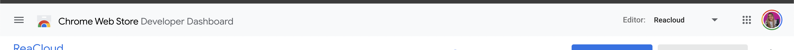

<p align="center">
  
</p>

<h1 align="center">
  Extensão para Chrome ReaCloud
</h1>

<p align="center">
 <a href="#project">Projeto</a> •
 <a href="#running">Rodando localmente</a> • 
  <a href="#running">Deploy</a> • 
 <a href="#contribute">Contribuindo</a>
</p>


<h2 id="project">Extensão para navegadores Chrome ReaCloud </h2>

Esse projeto foi construído com o intuito de facilitar o processo de publicação de Recursos para os usuários da ferramenta ReaCloud. A extensão permite que o usuário armazene no que chamamos de "Mochila" os links para os mais materias, para depois  publicá-los no repositório, fazendo o manuseio desses links no painel da ferramenta.

[Link para Chrome Store](https://chrome.google.com/webstore/detail/reacloud/flnllibpodbojpadpmpajmggfjchabdp?hl=pt-BR&authuser=0)

<h2 id="running">Rodando Localmente</h2>

Para rodar a extensão localmente no seu navagador Chrome você deve:

- Clonar esse repositório
- Abrir o link 'chrome://extensions/'
- Habilitar no canto direito o modo desenvolvedor
- Clicar na opção 'Carregar sem compactação'
- Escolher a pasta do projeto que você clonou no passo 1

📌 Lembre-se: a pasta que você deve realizar o upload para o Google é a `root` do projeto, que contém dentro de si a pasta `src` e os arquivos `manifest.json` e `README.md`

- Sempre que realizar uma mudança nos arquivos da extensão atualize o projeto no link [chrome://extensions/](chrome://extensions/), clicando em atualizar

<h3>Conectando com aplicação local </h3>
Para que seja possível que uma aplicação rodando localmente se conecte com a extensão você deve atualizar o valor de `externally_connectable` no arquivo `manifest.json`

Dentro do array de `matches` você deve adicionar a URL local que deseja conectar. Por exemplo, se estiver com ReaCloud rodando localmente, você atualizaria seu array de `matches` para o seguinte:

```json
  "externally_connectable": {
      "matches": ["https://reacloud.com.br/*", "http://localhost:3000/*"]
  },
```


<h2 id="contribute">Deploy 🚀</h2>

Para fazer o deploy da extensão siga esse passo a passo:

1. Atualize a versão da extensão no `manifest.json`
2. Compacte a pasta do projeto (gerando um .zip)
3. Entre na Chrome Web Store, no Dashboard de Desenvolvedor
4. Troque para a conta do Reacloud



5. Suba o pacote da nova versão
6. Clique em "Salvar Rascunho" e o "Enviar para análise"
6. Espere! O Google enviará um email quando tudo estiver pronto :)

<h2 id="contribute">Contribuindo 🚀</h2>

Se você deseja contribuir, clone esse repositório, crie sua branch e coloque a mão na massa!

```bash
git clone git@github.com:Fernanda-Kipper/ReaCloud-Extension.git
git checkout -b feature/NAME
```

 No final, abra um Pull Request explicando o problema/melhoria identificado, o que foi feito para resolver e screenshots das alterações visuais :)

[Como fazer um Pull Request](https://www.atlassian.com/br/git/tutorials/making-a-pull-request)

[Padrões de Commit](https://github.com/iuricode/padroes-de-commits)
