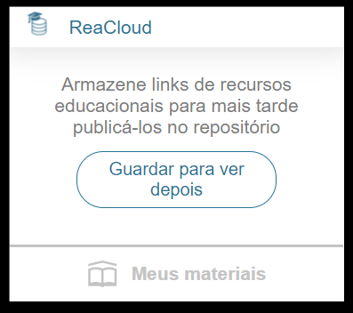
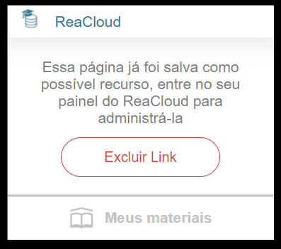

<h1 align="center">Extensão para Chrome do ReaCloud</h1>

## Table of Contents

- [Sobre](#Sobre-o-projeto)
- [Rodando Localmente](#Rodando-localmente)

## Sobre o projeto

Esse projeto foi construído com o intuito de facilitar o processo de geração de conteúdo para os usuários da ferramenta ReaCloud. A extensão permite que o usuário vá salvando links de recursos educacionais para mais tarde publicá-los no repositório, fazendo o manejo desses links mais tarde no ReaCloud.

<h1 align="center">
    
    
</h1>

## Rodando Localmente

Para rodar a extensão localmente no seu chrome você deve:

- Clonar esse repositório
- Abrir o link 'chrome://extensions/'
- Habilitar no canto direito o modo desenvolvedor
- Clicar na opção 'Carregar sem compactação'
- Escolher a pasta do projeto que você clonou no passo 1

📌 Lembre-se: a pasta que você deve realizar o upload para o Google é a `root` do projeto, que contém dentro de si a pasta `src` e os arquivos `manifest.json` e `README.md`

- Sempre que realizar uma mudança nos arquivos da extensão atualize o projeto no link 'chrome://extensions/', clicando em atualizar